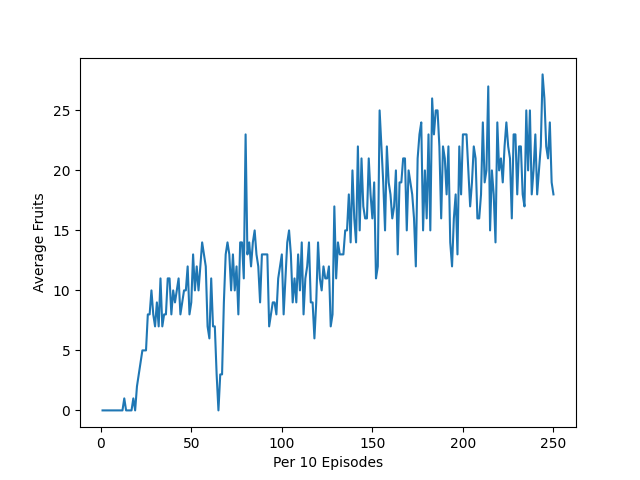
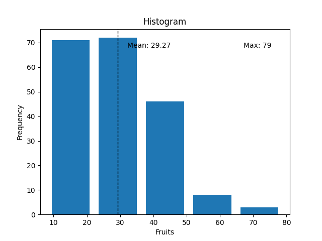

# Details
## State Space
My representation uses 12 bits of information to describe the current state of the snake:
- 4 bits of information to define the relative position of the fruit with respect to the head of the snake.
- 8 bits of information for obstacles in up, down, left, right and the diagonal directions.

## Action Space
The snake has 4 possible actions:

- Go Up
- Go Left
- Go Down
- Go Right
Hence our Q matrix has dimensions 8x15x4.
8 comes from the relative position of the fruit with respect to the head of the snake. 15 comes from the 4 bit obstacle space. 4 comes from the 4 actions.

## Reward Scheme
I have used a fairly simple reward scheme that can be optimized to improve the performance of the agent:
- Reward of +1 if the snake moves closer to the fruit
- Reward of -2 if the snake moves away from the fruit
- Reward of +30 for eating the fruit
- Reward of -300 for crashing into the wall or itself

## Hyperparameters
The discount factor and ε parameter for an ε-greedy policy are 0.5 and 0.1. Without decaying these hyperparameters, the training behaviour of the agent is extremely erratic. With annealing, the performance is more consistent. The agent has achieved a maximum score of 79.

The training time increases exponentially if we increase the state space (improve its vision).

## Training
We can get an idea about the training of our model by plotting the average number of fruits eaten by our snake in every 10 episodes as it trains.
For the obstacle state, the training graph is as follows:
.

## Trained Agent
We can plot a histogram of the number of fruits our agent consumes over a span of 300 episodes. This gives us an estimate of our performance. I've also added mean and max data outputs on the histogram itself.
.